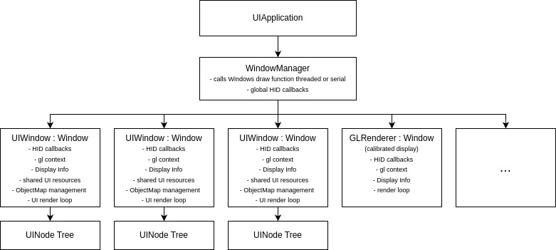
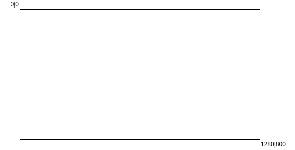
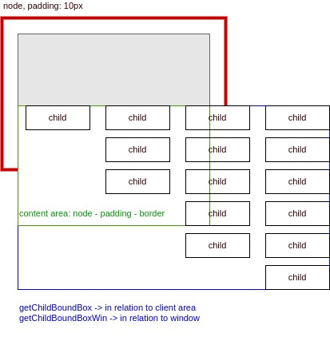
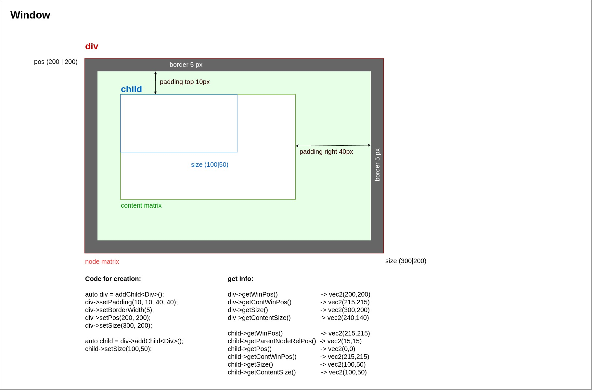
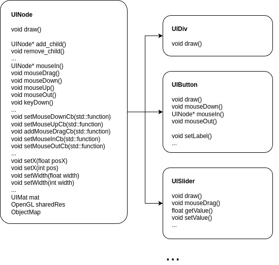
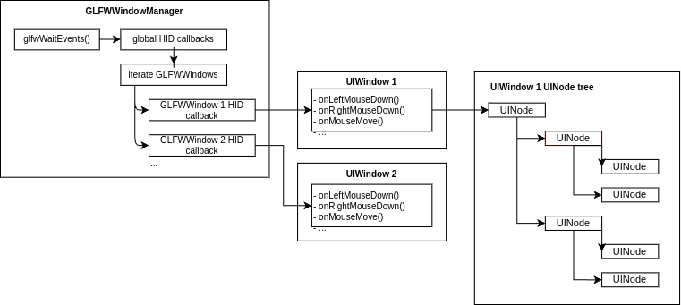
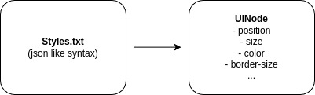
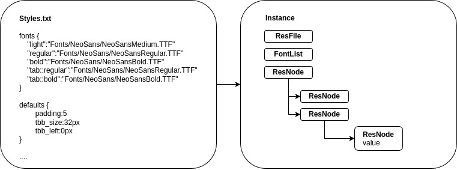
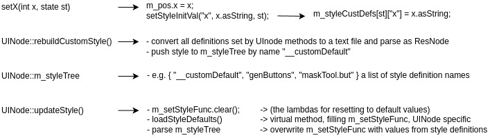

# UI

- [User Interaction](#user-interaction)
- [Drawing](#drawing)
- [Basic Application Component Design](#basic-application-component-design)
- [UIApplication in multithreaded mode](#uiapplication-in-multithreaded-mode)
- [UIApplication in single thread mode](#uiapplication-in-single-thread-mode)
- [Coordinate System](#coordinate-system)
- [UI Graph](#ui-graph)
- [Positioning](#positioning)
- [UINoode Base class and derivatives](#uinode-base-class-and-derivatives)
- [UINoode Tree processing](#uinode-tree-processing)
- [HID Processing](#hid-processing)
- [Styles](#styles)

## UI System

### User Interaction
- The GLSceneGraph UIWindow class, provides the following virtual methods which need to be bound to the underlying OS-specific HID managing library (like GLFW, QT or native OS calls):
  - `onKeyDown(int keyNum, bool shiftPressed, bool _ctrlPressed, bool _altPressed)`
  - `onLeftMouseButtonDown(float _xPos, float _yPos)`
  - `onLeftMouseButtonDownNoDrag(float _xPos, float _yPos)`
  - `onLeftMouseButtonUp()`
  - `onRightMouseButtonDown(float _xPos, float _yPos)`
  - `onRightMouseButtonUp()`
  - `onMouseMove(float _xPos, float _yPos, ushort _mode)`
  - `onWheel(int _deg)`
  - `onResizeDone()`
- all these methods acquire the s_procHidMtx mutex in form of a unique_lock and push a lambda function with the call to the respective glOnKeyDown(), glOnLeftMouseButtonDown(), etc method to the s_hidEvents list, which is processed on calling Scene::procHid()
- normally user interaction on UINode should either have an effect on the parameters/data of the UINode itself, or on other data which is part of the Scene. To resolve the first case UINode has the virtual methods `mouseIn()`, `mouseCursor()`, `mouseDown()`, `mouseOut()` which simply can be overloaded. To solve the latter case, there mouseClick, mouseIn, mouseOut and mouseCursor callback functions in form of std::functions member variables of UINode which can be set from outside and thus manipulate the data, which the std::functions capture.

### Drawing
- Processing Steps: A UI System basically should be event-based and render only when there has been user interaction which causes changes in the visible elements. For this reason there is the concept of ProcSteps or processing steps, which are nothing more than a std::function which an active/inactive flag, arranged in form of a std::map<procStepType, ProcStep>. Typically a Scene setup for UI cases consists of a continuous event-loop which iterates through the ProcSteps and executes them in case they are active and sets them inactive afterwards. So a procSteps map would at least contain something like:
  procSteps[Draw] = ProcStep{true, std::bind(&UIApp::drawNodeTree, this) };
- There may be animated elements or other elements that may need to be updated apart from user changes. Typically these are organized either as a separate list of std::functions which are called on every loop iteration or as a ProcStep which is always set to active.
- A UINodes matrices are only updated when the “m_geoChanged” flag is set (implicitly done by all methods such as setWidth(), setHeight(), setX() etc, which causes the UIMat’s updateMatrix() method to be called. Inside this method, the following calculations happen:
  - the actual parent view’s offset, size and aspect is calculated (in pixels) which makes use of the m_viewport member variable, which is set when the UINode is added as a child object. Basically only the root UINode will hold an vec4 viewport in form of an object, all other child UINodes will just hold a pointer to this root viewport - thus it changes on all children, when the root is updated
  - then the UINodes position and size values (either Pixel or relative) are transformed to absolute window-relative pixels. In this step the Align and Pivot settings are applied.
  - the result is a transformation matrix, composed of scaling and translation, which is multiplied by the parent matrix (the down-merged matrix-stack).
  - In case there are border settings, which are always in pixels, the relative line width in relation to the local matrix is calculated
  - since a UINode may be a container for other UINodes, there is the need to have zooming and positioning within UINode. This is done by the so called contentTransMat. First the position and size of the actual UINode is calculated, then the user defined rotation, scaling, zooming are transformed to matrices and multiplied. The get the final viewMat for “in-set” children elements this matrix is multiplied with the relative UINodes transformation matrix
  - all standard UINodes (Div, Label, Image) are rendered indirectly which is way faster then individual rendering, since it implies less state changes, value-passing and thus synchronization points between GPU and CPU. There is the DrawManager class which basically takes care of collecting, sorting of the UINodes vertex data and later shader setup for rendering. This process is quite complex since UINodes are assembled into one single VAO and all relevant standard textures (e.g. font glyphs) are merged into 3d-layer textures which then are referenced by indexes.
  - One big issue in indirect rendering is transparency, which basically can be solved by using z-positioning or z-sorting. Free z-position for any Node at any time, raises the necessity for several drawing passes (typically first drawing all solid elements and the all transparent element). Keeping a fixed order of Nodes which translates into z-order doesn't require multiple draw passes and results in better performance which is the reason why here it was implemented in this way.
  - There is also the possibility for inmediate mode rendering by pushing a lambda function to the DrawManager. This won't be evaluated immediately, but the order of rendering is kept and the function executed as-is.

### Basic Application Component Design

### UIApplication in multithreaded mode

- In the main thread a loop is running which is blocked, until an HID event is entering
- the WindowManager calls all global callback corresponding to this event and afterwards the corresponding UIWindow HID callback
- each UIWindow HID callback pushes the specific event to the gl-event queue and decide wheter to the UIWindows gl-loop has to be iterated or not
- In the UIWindows gl loop
  - the hid queue is processed (and has size 0 afterwards)
  - then all gl callbacks are processed
  - then when the draw flag is set, the UINode tree is processed (and drawn)

> [!NOTE]
> running an UIApplication in multithreaded mode is meant for cases where high draw performance is needed. No gl context switching is needed and data synchronisation is done via queues, BUT extreme care has to be taken in which context commands are executed. E.g. opening a window outside the main thread is prohibited and may cause a crash. Calling gl commands without a bound gl context will have no effect and may lead to undefined behaviour.
 
### UIApplication in single thread mode
- glfwWaitEvents()
- on event, global event callbacks are executed
- window specific gl context is bound
- window specific event callback is called
- UINode tree is processed / drawn if necessary
 
Event and gl loop are identical, no queues are needed, gl commands can be used at any time, windows can be opened at any time. This approach is much simpler than the multithreaded one and contain way less risks, since no synchronization of threads are needed. The downside is that gl context switching is need which is a bottleneck in situations where the highest performance possible is needed.

### Coordinate System

orthogonal matrix, origin left-top, unidades = pixels (float) 

### UI Graph

The UI graph is simple standard node structure with parent-child relations. 

### Positioning

- Alignment: align::left, align::right, align::center, valign::top, valign::bottom, valign::center
- Pivot: default is same as alignment, but can be set explicitly
- Padding: setPadding() -> equal on all sides or setPadding(left, top, right, bottom)

### UINode base class and derivatives

### UINode Tree processing

- recursive matrix update iteration
  - init the Node if necessary and build a styleSheet from it's default values
  - update the Node's styles if necessary
  - update it's matrix
    - get the parent's absolute content matrix and create a copy of it (sum of all parent nodes matrices)
    - calculate the parent's content viewport in pixels
    - calculate the nodes position (concerning int/float conversion, pivot point, alignment)
    - calculate the nodes size
    - if a fixed aspect is requested, adapt the size
    - calculate the content matrix (padding, border, content Transformation 2D/3D)
  - iterate through the nodes children and calculate a bounding box around them
- clear scissor stack
- recursive draw iteration
  - set gl scissoring if requested, depending on the parents viewport
  - call the UINode's draw function
  - call the UINode's objectmap draw function
  - push the actual viewport to the scissor stack
  - recursively iterate through all children

**Optimizations**
- recursive tree iteration is slower then parsing a flat list. During the first matrix iteration a flat list with all active nodes in the correct drawing can be created and used during the drawing step
- drawing of visible parts and drawing of object map can be done in one step, since they use the same matrices. Rendering is already done into an FBO with 2 attachments. The only thing missing is to integrate the objmap drawing part into all drawing shaders

### HID Processing

#### Brief description

- OS HID Events are received from glfw
- glfw calls global HID callbacks in GLFWWindowManger
- glfw calls window specific HID callbacks in GLFWWindowManager
- the UIWindows specific HID function is called
- inside the HID function, _UIWindow::getObjAtPos()_ is called using the actual mouse position. Here, the nodetree is recursively iterated from top to bottom. In case the mouse position is inside the bounds of the actual node, it is marked as found. in case it has more children, those are iterated and the process is repeated until the end of the tree is reached
- when a Node is found, a flat will be generated containing the node and all its parent elements. This list will then be iterated from bottom (lowest level) to top. Any node in this list can "consume" the hid event and prevent further propagation up the tree
- UINodes can be excluded from HID processing using the _excludeFromObjectMap(bool)_ method. Excluding a UINode implicitly excludes all its children
- each UINode is identified by a single or range of object IDs (depending on its content). in case the UINode is excluded from the object map, the ID will be -1
- UINode Ids are assigned once after changes in the tree during the drawing step
- An UINode must be visible, not in any _disabled*_ state and not excluded from object map in order to receive HID events
- it is also possible to set global HID callbacks not related to any specific Node using _UIWindow::addGlobalMouseDownLeftCb(...)_

### Styles

To take into account:
- UINode may have different positions, size, etc when selected, highlighted, etc
- when styles are edited via the styles.txt, default values are needed, in case a parameter is not set or deleted
- style parsing and updating of UINodes must be done in a well-defined order
- a C++ programmer may want to just setPosition, or setSize and will expect that after this command the corresponding values are updated
- style definitions must be inheritable in order to provide better control and keep text files small
- at the moment, default styles are managed by lambda functions which are overwritten, when a setPosition, or setSize command is issued

#### Style parsing

#### Style management

